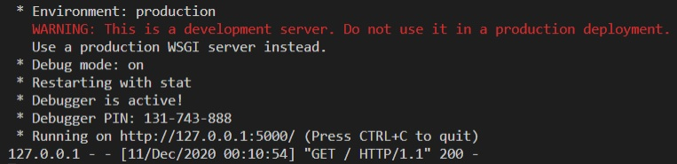
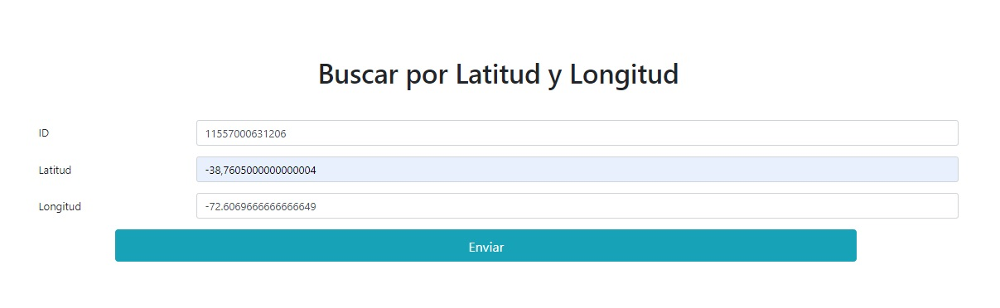
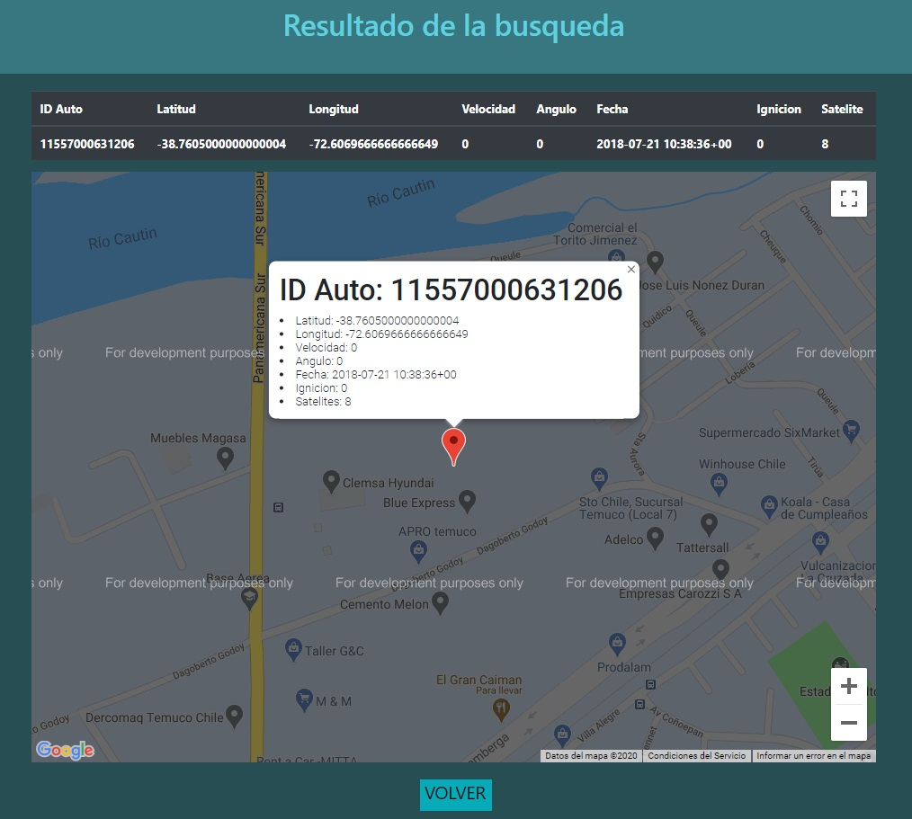

# Ec.Dif

El siguiente proyecto es el avance final hasta el ultimo sprint del ramo Ecuaciones Diferenciales del trabajo 2

## Ejecutando las pruebas ⚙️

Para ejecutar este proyecto se debe iniciar el archivo app.py en una consola y cargar la DB
```
python .\app.py
```

El cual como se ve en la imagen se debe iniciar en un navegador con la siguiente ruta:
```
http://127.0.0.1:5000/
```

## Construido con 🛠️


* [Python 3.8](https://www.python.org)

## Captura de la interfaz gráfica
Formulario de entrada de datos

Resultado


## Autores ✒️


* **Nicolás Rivas** [nrivas2017](https://github.com/nrivas2017)
* **Ignacio Ringler** [ringler0](https://github.com/ringler0)


También puedes mirar la lista de todos los [contribuyentes](https://github.com/ringler0/Ec.Dif/graphs/contributors) quíenes han participado en este proyecto. 
